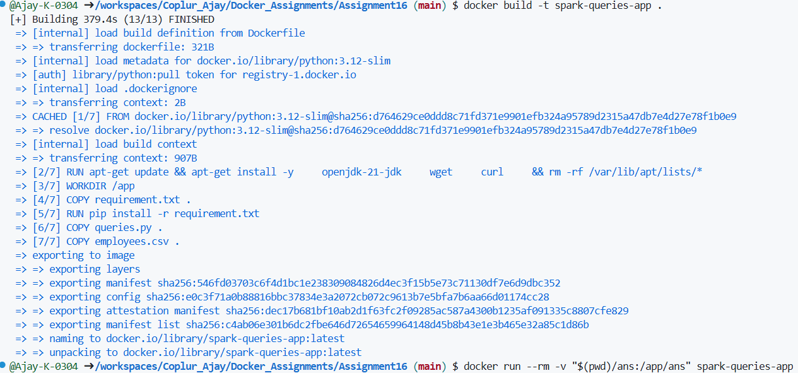
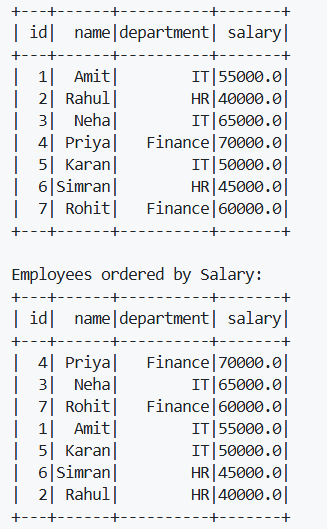
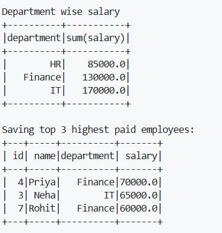

For building docker image use command `docker build -t container-name .`
E.g `docker build -t spark-queries-app .`

This will create an image from present working directory's Dockerfile 

Then use `docker run --rm container-name`
This will run our image to create a container and run scripts inside it as soon as container is started
* The `--rm` flag in the `docker run` command tells Docker to automatically delete the container and its file system as soon as it stops or exits.

E.g `docker run --rm -v "$(pwd)/ans:/app/ans" spark-queries-app` 
Here we used `-v` flag  , because we want our ans output to be stored outside of container.

You should get outputs like these

