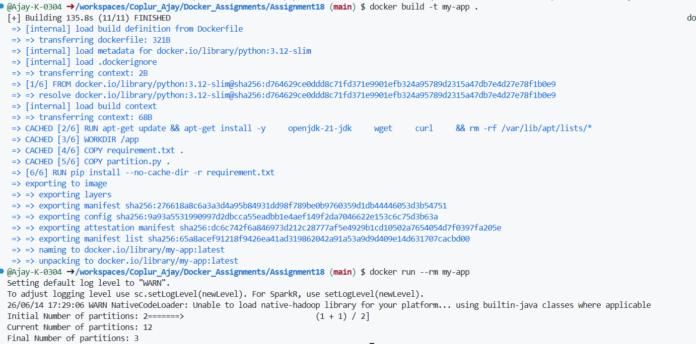

For building docker image use command `docker build -t container-name .`
This will create an image from present working directory's Dockerfile 

Then use `docker run --rm container-name`
This we run our image to create a container and run scripts inside it as soon as container is started
* The `--rm` flag in the `docker run` command tells Docker to automatically delete the container and its file system as soon as it stops or exits.

You should get output like this 
